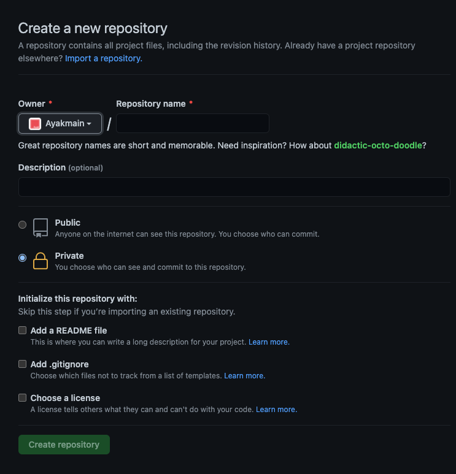

# Git 사용법

---

## 순서

---

1. Github Repo 만들기
2. Github Local 폴더에 저장법

- clone 방법
- 파일에서 Git 추가 방법

3. Git Repo 사용법
4. Repo Github에서 보기
5. Repo Readme 보는 법

## 1. Git Repo 만들기

---

Git에 들어가면 다음과 같은 회사 Organizations 페이지가 나옵니다.

사진에 보이는 왼쪽에 New 버튼을 눌러 Repo 생성 페이지를 열어줍니다.

다음 Repo 생성 페이지에서 Repository name에 Repo이름을 설정해주는 부분입니다. 또한 Description 부분에는 해당 Repo에 대한 설명을 적을 수 있습니다.

밑에 부분에서 Public 과 Private이 있는데 Public은 접근 권한이 없는 다른 사람들도 해당 Repo를 확인할 수 있는 Repo를 생성할 수 있습니다.
Private 설정은 해당 Repo에 권한이 없으면 접근하여 해당 Repo를 확인할 수 없도록 설정합니다.

Initalize this Repository With 부분은 Repo에 대한 부가적인 부분입니다.

- Add a README file은 README.md파일을 생성하여 Github에서 Repo에 들어갔을 떄 첫번째 보이는 페이지를 생성합니다.해당 사진은 Readme파일을 선택 후 생성했을 때 입니다.
  
- Add .gitignore는 Git add, commit, push를 할 때 제거하고 github에 코드를 올리는 파일을 뜻합니다.

## 2. Github Local 폴더에 저장법

---

#### Clone 방법

Git Repo에서 Code 부분을 누르면 다음과 같이 Clone 밑에 HTTP/ SSH와 같이 나오는데 HTTP를 선택 후 복사하여 `git clone 복사한 코드`로 terminal에서 원하는 폴더에 Clone을 해줍니다. 저의 경우 Desktop에 clone하여 배경화면에 해당 Repo를 불러왔습니다. clone이 완료가 되면 `cd 폴더명`을 사용하여 clone한 폴더로 이동하여 줍니다.

#### Local 파일에서 Git을 추가해주는 방법

Terminal창에서 원하는 Local 파일로 이동(`cd 파일 경로`)하여 `git init`을 사용하여 해당 파일에 git을 넣어주고 `git remote add origin Repo에서 복사한 Http`사용하여 github과 연결해 줍니다.

## 3. Git Repo 사용법

---

위에 방법까지 따라왔다면 Git Repo와 파일이 연결되었습니다.
이 부분에서 VSCode와 같은 코딩툴을 사용해서 파일을 수정 후 저장한 후 다시 github에 코드를 올려주어야하는데 다음과 같이 코드를 Terminal 창에서 작성해주면 됩니다.
